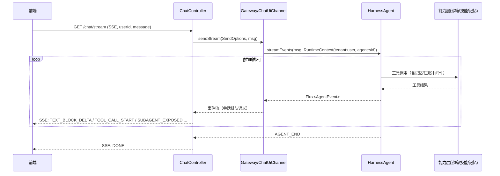

# 设计文档（Design Doc）—— 企业级多租户 AI Agent 工作台

> 产品代号：**AgentScope Workbench**
> 基础框架：AgentScope Java **v2.0.0** / Spring Boot **4.1.0** / Java 17
> 版本：v1.0-draft
> 关联文档：[需求文档 PRD](./PRD.md)

---

## 1. 总体架构

### 1.1 架构分层

```
┌─────────────────────────────────────────────────────────────────────┐
│  接入层  Presentation                                              │
│  ┌────────────────┐  ┌─────────────────┐  ┌──────────────────────┐  │
│  │ ChatController │  │ AdminController │  │ 演示前端 (静态页面)   │  │
│  │ REST + SSE     │  │ 会话/任务/Plan   │  │ fetch + EventSource  │  │
│  └───────┬────────┘  └────────┬────────┘  └──────────────────────┘  │
└──────────┼────────────────────┼─────────────────────────────────────┘
┌──────────▼────────────────────▼─────────────────────────────────────┐
│  会话路由层  Gateway                                                │
│  GatewayBootstrap(多Agent注册) → ChatUiChannel(SendOptions路由)     │
│  Per-session 并发排队 / userId→session 映射 / agentId 路由          │
│  SubagentGatewayBridge（expose_to_user 接线）                        │
└──────────┬───────────────────────────────────────────────────────────┘
┌──────────▼───────────────────────────────────────────────────────────┐
│  Agent 组装层  AgentFactory（配置驱动构建 HarnessAgent）             │
│  ┌───────────────────────────────────────────────────────────────┐  │
│  │  HarnessAgent.Builder                                        │  │
│  │  .model / .sysPrompt / .workspace / .steps / .temperature    │  │
│  │  .filesystem(spec)  .memory(MemoryConfig)  .compaction(...)  │  │
│  │  .enablePlanMode()  .toolResultEviction(...)                 │  │
│  │  .skillRepository(...)×N  .subagent(...)×N                   │  │
│  │  .stateStore / .distributedStore  .middleware(OTel)          │  │
│  └───────────────────────────────────────────────────────────────┘  │
└──────┬───────────────┬───────────────┬───────────────┬──────────────┘
┌──────▼───────┐ ┌──────▼──────┐ ┌──────▼──────┐ ┌──────▼──────────────┐
│ 能力层        │ │ 能力层       │ │ 能力层       │ │ 基础设施层           │
│ Filesystem   │ │ Skill       │ │ Memory      │ │ DistributedStore    │
│ ├Local       │ │ ├GitSkill   │ │ ├Flush      │ │ ├AgentStateStore    │
│ ├Remote      │ │ ├Classpath  │ │ ├Consolidate│ │ │  (JsonFile/Redis) │
│ └Sandbox     │ │ ├Mysql      │ │ ├压缩/卸载   │ │ ├BaseStore(Redis)   │
│  (Docker…)   │ │ └workspace/ │ │ └记忆工具    │ │ ├SnapshotSpec       │
│              │ │  user覆盖   │ │             │ │ └ExecutionGuard     │
│              │ └────────────┘ │             │ └─────────────────────┘
│              │                │             │  OtelTracingMiddleware
└──────────────┘ └──────────────┘             │  ModelRegistry
                                               └─────────────────────┘
```

### 1.2 设计原则

1. **配置驱动，代码零改动切换模式**：所有官方能力点映射为配置项，`AgentFactory` 按配置组装 Builder。
2. **官方能力优先，少做二次封装**：能直接用官方 API 的不包壳；平台只做「装配、路由、暴露、管理」四件事。
3. **profile 双轨**：`dev` = 单机无外部依赖；`prod` = Redis + Docker + OTel。
4. **租户隔离下沉到 RuntimeContext**：`userId = tenantId:userId`、`sessionId = agentId:sessionId`，官方存储按二元组寻址天然隔离。

---

## 2. 技术选型

| 关注点 | 选型 | 理由 |
|--------|------|------|
| 应用框架 | Spring Boot 4.1.0（WebFlux） | SSE 天然适配 Reactor `Flux<ServerSentEvent>`；`agent.streamEvents()` 返回 `Flux<AgentEvent>` 可直接透传 |
| Agent 框架 | agentscope-harness 2.0.0 | 目标框架 |
| 状态存储（dev） | `JsonFileAgentStateStore`（core 内置） | 零依赖 |
| 状态存储（prod） | `RedisAgentStateStore`（agentscope-extensions-redis，Jedis 客户端） | 官方首选、低延迟 |
| 共享 KV（prod） | `RedisStore`（Lua CAS + ZRANGEBYLEX prefix search） | 多副本一致 |
| 沙箱 | Docker（agentscope-extensions-sandbox-docker） | 本地可跑、生态成熟 |
| 快照 | `LocalSnapshotSpec`（dev）/ `RedisSnapshotSpec`（prod，distributedStore 自动注入） | 官方矩阵 |
| 技能市场 | `ClasspathSkillRepository` + `GitSkillRepository` + `MysqlSkillRepository`（可叠加） | 覆盖三来源 |
| 观测 | OpenTelemetry SDK + `OtelTracingMiddleware`（OTLP exporter） | 官方支持 |
| 测试 | JUnit 5 + Testcontainers（Redis）+ WebTestClient | 集成测试 |
| 鉴权（简化） | 平台级 API Key（请求头），后续可换 Spring Security | 本期最小可用 |

> 依赖模块按 Maven profile 隔离：`dev` 只引 core + harness + web；`prod` 额外引入 redis、docker sandbox、otel 扩展。

---

## 3. 模块与包结构

```
com.agent.agentscopenew
├── AgentScopeWorkbenchApplication.java      # 启动类
├── config/
│   ├── WorkbenchProperties.java             # 平台配置模型（@ConfigurationProperties）
│   ├── AgentProperties.java                 # 单 Agent 配置模型
│   ├── ModelConfig.java                     # provider:model 解析
│   ├── FilesystemConfig.java                # 三模式工厂
│   ├── StoreConfig.java                     # dev/prod 状态存储装配
│   ├── SandboxConfig.java                   # Docker 沙箱 spec 工厂
│   ├── SkillConfig.java                     # 技能市场装配（多来源叠加）
│   ├── MemoryCompactionConfig.java          # Memory/Compaction/ToolEviction 装配
│   └── OtelConfig.java                      # OpenTelemetry 初始化
├── agent/
│   ├── AgentFactory.java                    # ★ 配置 → HarnessAgent 组装
│   ├── AgentRegistry.java                   # 多 Agent 注册表 + GatewayBootstrap
│   ├── SubagentCatalog.java                 # 内置子 Agent 声明（编程式）
│   └── BuiltinSkills.java                   # classpath 内置技能常量
├── channel/
│   ├── ChatController.java                  # REST + SSE 接口
│   ├── SseEventMapper.java                  # AgentEvent → SSE JSON 协议
│   └── AdminController.java                 # 管理 API（tasks/plan/permission）
├── security/
│   ├── ApiKeyFilter.java                    # 平台级 API Key 校验
│   └── TenantContext.java                   # 请求头 → RuntimeContext 装配
└── webapp/
    └── static/index.html                    # 演示前端（原生 JS + EventSource）
```

---

## 4. 关键设计

### 4.1 AgentFactory：配置驱动的组装（核心设计）

输入：`AgentProperties`（YAML）；输出：`HarnessAgent`。

```java
public HarnessAgent build(AgentProperties p) {
    var builder = HarnessAgent.builder()
        .name(p.name())
        .model(p.model())
        .sysPrompt(p.sysPrompt())
        .workspace(p.workspace())
        .steps(p.steps())
        .enablePlanMode(p.planMode().enabled())
        .planFileDirectory(p.planMode().planDirectory());

    // 文件系统三模式（互斥，由 profile 决定生效分支）
    switch (p.filesystem().mode()) {
        case LOCAL  -> builder.filesystem(new LocalFilesystemSpec());          // dev 默认
        case REMOTE -> builder.filesystem(new RemoteFilesystemSpec()          // prod 多副本
                .isolationScope(p.filesystem().isolationScope())
                .anonymousUserId(p.filesystem().anonymousUserId()));
        case SANDBOX -> builder.filesystem(new DockerFilesystemSpec()          // 隔离执行
                .image(p.sandbox().image())
                .isolationScope(p.filesystem().isolationScope())
                .memorySizeBytes(p.sandbox().memoryBytes())
                .cpuCount(p.sandbox().cpuCount())
                .snapshotSpec(storeConfig.snapshotSpec())                     // dev: Local / prod: Redis(自动)
                .executionGuard(storeConfig.executionGuard()));               // prod: Redis guard
    }

    // 记忆与压缩（官方默认值之外显式声明，便于文档与配置对照）
    if (p.memory().enabled()) {
        builder.memory(MemoryConfig.builder()
                .flushTrigger(p.memory().flushTrigger())       // ALWAYS / THROTTLED / NEVER
                .model(p.memory().model())                     // 小模型省成本
                .consolidationMinGap(p.memory().consolidationMinGap())
                .build());
    }
    if (p.compaction().enabled()) {
        builder.compaction(CompactionConfig.builder()
                .triggerMessages(p.compaction().triggerMessages())
                .keepMessages(p.compaction().keepMessages())
                .model(p.compaction().model())
                .build());
        builder.toolResultEviction(ToolResultEvictionConfig.defaults());
    }

    // 技能市场：先注册优先级低，后注册覆盖 → Classpath 最底、Git 其次、Mysql 最顶
    p.skills().repositories().forEach(repo -> builder.skillRepository(repo));
    // 子 Agent 声明：编程式内置 3 个演示子 agent
    SubagentCatalog.declarations(p).forEach(builder::subagent);

    // 生产：分布式一键配置（自动注入 stateStore + baseStore + snapshot + guard）
    storeConfig.applyDistributed(builder);   // prod profile 下执行
    return builder.build();
}
```

**构建期校验链路（复刻官方行为）：**
- `REMOTE` 模式且未配分布式 store / stateStore → `IllegalStateException`（fail fast）。
- `SANDBOX` 模式 + 本地 JsonFile state → warn 日志（沙箱状态不能跨 JVM 恢复）。
- 自定义 consolidationPrompt 含两个 `%d` 占位符校验由官方 Builder 保证。

### 4.2 Gateway 与会话路由

- 启动时 `AgentRegistry` 用 `GatewayBootstrap.builder()` 注册全部 Agent，`mainAgent` 指向配置默认。
- `ChatUiChannel` 由 `gw.chatUiChannel()` 取得，注入 `ChatController`。
- **expose_to_user 接线**：`gw.gatewayBridge()` 获取 `SubagentGatewayBridge` 并注入每个 Agent 的 `SubagentsMiddleware`（`agent.channel()` 自动完成，若走 GatewayBootstrap 需手动接线，文档已明确）。

**会话键设计：**

| 维度 | 值 | 说明 |
|------|-----|------|
| tenantId | 请求头 `X-Tenant-Id` | 平台租户 |
| userId | `tenantId + ":" + rawUserId` | 官方存储键的第一分量 |
| sessionId | `agentId + ":" + rawSessionId`（缺省则由 Gateway 按 userId 生成稳定 session） | 第二分量 |
| agentId | SendOptions.withAgentId() | 路由目标 |

### 4.3 SSE 事件协议

`GET /api/v1/chat/stream?userId=..&sessionId=..&agentId=..&message=..` 返回 `Flux<ServerSentEvent<String>>`，每条事件 JSON：

```json
{ "type": "TEXT_BLOCK_DELTA", "id": "evt-001", "delta": "你好" }
{ "type": "TOOL_CALL_START",  "id": "evt-002", "toolCallName": "agent_spawn", "toolCallId": "call-1" }
{ "type": "TOOL_RESULT_END",  "id": "evt-003", "toolCallName": "agent_spawn", "status": "SUCCESS" }
{ "type": "SUBAGENT_EXPOSED", "id": "evt-004", "subagentId": "sa-xxx", "agentId": "researcher", "label": "调研员" }
{ "type": "AGENT_END",        "id": "evt-005", "finishReason": "END" }
```

`SseEventMapper` 白名单映射（事件类型与官方 `AgentEvent` 子类一一对应：`TextBlockDeltaEvent` / `ToolCallStartEvent` / `ToolResultEndEvent` / `SubagentExposedEvent` / `AgentEndEvent` 等，其余事件类型原样透传 type 名，前端可忽略未知类型，保证前向兼容）。事件流结束发送 `DONE` 事件（`event: done` 注释行），便于前端断开。

### 4.4 演示前端

- 单页 `index.html`：消息输入、SSE 流式渲染（delta 追加）、工具调用折叠卡片、子 Agent 暴露后生成新对话 Tab（携带 subagentId 直连）、Plan 审批按钮（调管理 API 批准/拒绝）。

### 4.5 管理 API

| 接口 | 方法 | 说明 |
|------|------|------|
| `/api/v1/admin/agents` | GET | Agent 注册表 |
| `/api/v1/admin/sessions/{tenant}:{user}/{sessionId}/tasks` | GET | todo 任务列表 |
| `/api/v1/admin/sessions/{...}/plan` | GET | Plan 状态 |
| `/api/v1/admin/sessions/{...}:enter-plan-mode` | POST | 程序化进入 Plan |
| `/api/v1/admin/sessions/{...}:exit-plan-mode` | POST | 程序化退出（绕过 HITL，仅管理员） |
| `/api/v1/admin/sessions/{...}/permission-mode` | GET/PUT | `PermissionMode`（BYPASS 仅沙箱模式允许） |

### 4.6 演示子 Agent 目录（工作区声明）

```
workspace/subagents/
├── reviewer.md      # 代码审查专家（tools 白名单: read_file/grep_files/…，规避 Plan 缺口）
├── researcher.md    # 调研员（expose_to_user 演示）
└── note-taker.md    # 笔记员（persistSession 演示）
```

内置技能（classpath）：

```
src/main/resources/skills/
├── code-reviewer/SKILL.md      # 代码审查流程 + references/style-guide.md
└── report-writer/SKILL.md      # 数据分析报告模板
```

### 4.7 配置模型（application.yml 示意）

```yaml
workbench:
  api-key: ${WORKBENCH_API_KEY}          # 平台鉴权
  main-agent: rnd-assistant
  agents:
    - name: rnd-assistant
      model: ${LLM_MODEL:openai:gpt-4o}
      sys-prompt: 你是一个研发助手…
      workspace: ./workspace
      steps: 30
      memory:
        enabled: true
        flush-trigger: THROTTLED(10m)    # 省 token
        model: ${MEMORY_MODEL:openai:gpt-4.1-mini}
      compaction:
        enabled: true
        trigger-messages: 40
        keep-messages: 10
      plan-mode: { enabled: true, allow-shell: false }
      filesystem: { mode: ${FS_MODE:LOCAL}, isolation-scope: USER, anonymous-user-id: "_default" }
      sandbox: { image: ubuntu:24.04, memory-mb: 512, cpu-count: 2 }
      skills:
        repositories: [ classpath, git ]  # classpath 内置 + Git 团队仓库
        git-url: ${SKILLS_GIT_URL:}
      subagents: [ reviewer, researcher, note-taker ]
```

`dev` / `prod` profile 差异（`application-{profile}.yml`）：

| 配置项 | dev | prod |
|--------|-----|------|
| `workbench.store` | json-file（默认） | redis |
| `workbench.redis.url` | — | `redis://…` |
| `workbench.filesystem.mode` | LOCAL | REMOTE（或 SANDBOX） |
| `workbench.sandbox.snapshot` | local | redis（distributedStore 自动） |
| `workbench.otel.endpoint` | 空（关闭） | `http://otel-collector:4317` |

---

## 5. 数据流设计

### 5.1 流式对话时序（SSE）



### 5.2 记忆/压缩在 call 周期中的位置（官方机制透传）

```
call() 开始
  ├─ <memory_context> 注入（MEMORY.md）
  ├─ 每轮推理前: CompactionMiddleware 检查阈值 → 触发摘要(先 flush + offload)
  ├─ 工具执行后: ToolResultEvictionMiddleware 卸载大结果
  ├─ 模型报 context_length_exceeded → recoverFromOverflow 极端压缩 + 重试
  └─ call() 结束
      ├─ MemoryFlushMiddleware（按 FlushTrigger）→ memory/YYYY-MM-DD.md（异步）
      ├─ 后台维护（节流: 归档/consolidation/清理）
      └─ AgentState 持久化（stateStore）
```

---

## 6. 部署架构

### 6.1 dev（单机）

```
Windows/Linux 单进程
  Spring Boot (dev profile)
    ├─ HarnessAgent × N（LocalFilesystem + JsonFile state）
    ├─ 演示前端（内嵌静态资源）
    └─ Model API（需外网或内网模型网关）
```

### 6.2 prod（多副本）

```
                 ┌──────────── LB ────────────┐
                 ▼                            ▼
         ┌──────────────┐            ┌──────────────┐
         │ Pod A        │            │ Pod B        │
         │ Spring Boot  │            │ Spring Boot  │
         │ prod profile │            │ prod profile │
         └──────┬───────┘            └──────┬───────┘
                │                           │
   ┌────────────┼───────────────────────────┼────────────┐
   ▼            ▼                           ▼            ▼
Redis(Cluster)  Redis: BaseStore/锁         OSS/S3        OTel Collector
(AgentStateStore+Snapshot)                  (快照可选)      ↓ OTLP
                                                        Grafana Tempo / Jaeger
```

- 副本间无本地状态，任意 pod 可接管任意 `(tenant,user,session)`。
- 沙箱执行：`DockerFilesystemSpec` + `IsolationScope.USER` + Redis 快照 + `RedisSandboxExecutionGuard`（distributedStore 自动注入）。
- 静态资产（AGENTS.md / skills / knowledge）由 GitOps 同步到各 pod 工作区作为只读模板，运行时产物走 Redis KV。

---

## 7. 安全设计

| 威胁 | 对策 |
|------|------|
| 未授权访问 API | `ApiKeyFilter` 校验 `X-API-Key`（平台级），管理 API 需管理员 Key |
| 跨租户串读 | userId/sessionId 复合键 + 每个请求强制装配 RuntimeContext；集成测试覆盖 |
| 不可信代码执行 | 默认沙箱模式：Docker 容器内存/CPU 限制、`network` 默认隔离、镜像基线自检；Plan Mode 拒绝写工具 |
| 提示注入 | Plan Mode + 权限规则（ASK/DENY）；`PermissionMode.BYPASS` 仅沙箱下开放 |
| 敏感配置泄露 | API Key / Redis URL 一律环境变量注入，不落配置文件 |
| 记忆污染（跨用户） | `IsolationScope.USER` + `<userId>/skills/` 用户级覆盖，测试验证 |

---

## 8. 测试策略

| 层级 | 内容 | 工具 |
|------|------|------|
| 单元 | 配置解析、SseEventMapper、TenantContext 装配、AgentFactory 分支 | JUnit 5 |
| 集成 | 本地模式端到端对话（内存 store + LocalFilesystem）；记忆/压缩中间件行为 | JUnit 5 |
| 集成 | Redis store 会话恢复、多租户隔离（Testcontainers） | Testcontainers |
| 集成 | Docker 沙箱：创建/执行/快照/恢复（CI Linux runner） | Testcontainers Docker |
| E2E | 3 个演示场景脚本（研发审查 / 知识问答 / 沙箱报告）+ SSE 协议断言 | WebTestClient + 演示页冒烟 |
| 演练 | 进程重启恢复、副本接管、沙箱容器销毁恢复 | 手动脚本 |

---

## 9. 实施顺序（与里程碑对齐）

1. **M1**：pom 依赖（agentscope 2.0.0 版本属性 + 模块划分）、配置模型、`AgentFactory` 最小路径（LOCAL 模式）、`ChatController` REST + SSE、演示页雏形、`SseEventMapper`。
2. **M2**：`MemoryCompactionConfig` 装配、记忆/压缩/session 工具验证、成本优化（THROTTLED + 小模型）。
3. **M3**：`SubagentCatalog` + 工作区声明、后台任务反向通知、Plan Mode + HITL 审批 API、`AdminController`。
4. **M4**：`SandboxConfig`（Docker）、快照、`SkillConfig`（Classpath + Git）、四层优先级验证。
5. **M5**：`StoreConfig` prod 分支（RedisDistributedStore）、GatewayBootstrap 多 Agent、OTel、构建期校验、健康检查。
6. **M6**：端到端打磨、测试补全、文档（配置说明 + SSE 协议）。

---

## 10. 风险与决策记录（ADR 摘要）

| # | 决策 | 理由 | 状态 |
|---|------|------|------|
| ADR-1 | 使用 WebFlux + SSE 而非 WebMVC 轮询 | 官方 Channel 事件流原生 Reactor，零转换 | 已定 |
| ADR-2 | `userId = tenantId:userId` 复合字符串 | 官方文档明确推荐；无需改官方代码 | 已定 |
| ADR-3 | 沙箱首版只做 Docker，K8s/E2B/Daytona/AgentRun 留配置骨架 | Windows 本地可验证；官方五后端接口一致，后续增量 | 已定 |
| ADR-4 | 技能市场默认 Classpath + Git；MySQL 市场按需开启 | 平台内置技能 + 团队仓库已覆盖多数场景 | 已定 |
| ADR-5 | 演示子 Agent 用 `tools` 白名单规避 Plan 限制不传播缺口 | 官方已知问题，白名单是文档建议的兜底 | 已定 |
| ADR-6 | OTel 用 OTLP gRPC 导出，endpoint 为空则自动跳过中间件 | 本地开发零依赖 | 已定 |

---

## 11. 附录：官方能力 → 设计落点索引

| 官方能力 | 设计落点 |
|---------|---------|
| `HarnessAgent.builder()` | §4.1 AgentFactory |
| `LocalFilesystemSpec` / `RemoteFilesystemSpec` / `DockerFilesystemSpec` | §4.1 filesystem switch |
| `IsolationScope` / `anonymousUserId` | §4.1 + §4.2 会话键 |
| `BaseStore` 路由表 / `WorkspaceIndex` | §4.1 REMOTE 分支（prod） |
| `NoopSnapshotSpec` / `SandboxSnapshotSpec`（接口）/ `LocalSnapshotSpec` / `RedisSnapshotSpec` / `OssSnapshotSpec` / `JdbcSnapshotSpec` | §4.1 SANDBOX 分支 `storeConfig.snapshotSpec()`（distributedStore 自动注入） |
| `SandboxExecutionGuard`（Redis / JDBC / 自定义） | §4.1 SANDBOX 分支 + §6.2 |
| `SandboxContext`（自管沙箱/外部快照/共享实例） | FR-3.7 编程式透传，M6 实现 |
| `workspaceProjectionEnabled` / `workspaceProjectionRoots`（Workspace Projection） | §4.1 SANDBOX 分支 + §4.6 沙箱内技能（默认根列表 AGENTS.md、skills、subagents、knowledge） |
| `GitSkillRepository` / `ClasspathSkillRepository` / `MysqlSkillRepository` / `NacosSkillRepository` | §4.7 skills 配置 + §4.6（Nacos 为扩展位，本期不激活） |
| `MemoryConfig`（flushTrigger / consolidationPrompt / model / retention） | §4.1 memory 分支 + §5.2 |
| `memory_search` / `memory_get` 记忆工具 | 记忆启用时自动注册（FR-5.4） |
| `CompactionConfig`（含 `TruncateArgsConfig`）/ `ToolResultEvictionConfig` | §4.1 compaction 分支 + §5.2 |
| `recoverFromOverflow` 溢出兜底 | compaction 开启后自动生效（FR-6.2） |
| `session_list` / `session_history` / `session_search` | 会话能力默认开启自动注册（FR-6.5） |
| `enablePlanMode` / `planFileDirectory` / `allowShellInPlanMode` | §4.1 plan 分支 |
| `plan_enter` / `plan_write` / `plan_exit` / HITL | §4.1 + §4.5 管理 API（Plan 三件套工具由官方 PlanMode 中间件注册） |
| `enableTaskList` / `todo_write` / tasks 持久化 | §4.1 + §4.5 任务 API（`AgentState.tasksContext`） |
| `PermissionMode`（DEFAULT / DONT_ASK / BYPASS） | §4.5 permission-mode API（BYPASS 仅沙箱） |
| `SubagentDeclaration`（workspace / inlineAgentsBody / url 三选一） | §4.6 SubagentCatalog + 工作区声明 |
| `general-purpose` 内置子 agent | 总是可用，无需声明（FR-8.1） |
| `agent_spawn` / `agent_send` / `agent_list` 实例管理 | SubagentsMiddleware 自动注册（FR-8.5） |
| `task_output` / `wait_async_results` / `task_cancel` / `task_list` 后台任务 | SubagentsMiddleware 自动注册（FR-8.5） |
| 后台任务自动反向通知（`<system-reminder>`） | 官方默认行为（FR-8.4） |
| `persistSession` / `expose_to_user` | §4.6 子 agent 声明 + §4.2 bridge |
| `GatewayBootstrap` / `ChatUiChannel` / `SendOptions` / SSE | §4.2 / §4.3 |
| `SubagentExposedEvent` / `sendToSubagent(Stream)` | §4.3 SSE 协议 + §4.4 前端 Tab |
| `SubagentGatewayBridge`（GatewayBootstrap 下 expose 接线） | §4.2 手动接线说明 |
| `DistributedStore`（Redis） | §4.1 applyDistributed + §6.2 |
| `OtelTracingMiddleware` | §3 OtelConfig + §6.2 |
| `RuntimeContext` 装配（userId/sessionId 复合键） | §4.2 TenantContext |
